# Data Flow Graph - Laravel Multi-vendor E-commerce Application

## Level 1 Data Flow Diagram (Visual Graph)

```mermaid
graph TD
    %% External Entities
    Customer[👤 Customer/User]
    Vendor[🏪 Vendor]
    Admin[👨‍💼 Admin/Superadmin]
    PaymentGW[💳 Payment Gateway]
    ShippingAPI[🚚 Shipping Service]
    EmailSvc[📧 Email Service]
    SMSSvc[📱 SMS Service]

    %% Main Processes
    UserMgmt[1.0 User Management]
    ProductMgmt[2.0 Product Management]
    OrderMgmt[3.0 Order Management]
    PaymentProc[4.0 Payment Processing]
    InventoryMgmt[5.0 Inventory Management]
    ContentMgmt[6.0 Content Management]
    CommProc[7.0 Communication Process]
    Analytics[8.0 Analytics & Reporting]

    %% Data Stores
    UsersDB[(Users Database)]
    ProductsDB[(Products Database)]
    OrdersDB[(Orders Database)]
    PaymentsDB[(Payments Database)]
    CategoriesDB[(Categories Database)]
    CouponsDB[(Coupons Database)]
    AnalyticsDB[(Analytics Database)]
    ContentDB[(Content Database)]

    %% Customer Flows
    Customer <--> UserMgmt
    Customer <--> ProductMgmt
    Customer <--> OrderMgmt
    Customer <--> PaymentProc

    %% Vendor Flows
    Vendor <--> UserMgmt
    Vendor <--> ProductMgmt
    Vendor <--> OrderMgmt
    Vendor <--> InventoryMgmt

    %% Admin Flows
    Admin <--> UserMgmt
    Admin <--> ContentMgmt
    Admin <--> Analytics

    %% External Service Flows
    PaymentGW <--> PaymentProc
    ShippingAPI <--> OrderMgmt
    EmailSvc <--> CommProc
    SMSSvc <--> CommProc

    %% Process to Database Flows
    UserMgmt <--> UsersDB
    ProductMgmt <--> ProductsDB
    ProductMgmt <--> CategoriesDB
    OrderMgmt <--> OrdersDB
    PaymentProc <--> PaymentsDB
    PaymentProc <--> CouponsDB
    InventoryMgmt <--> ProductsDB
    ContentMgmt <--> ContentDB
    ContentMgmt <--> CategoriesDB
    Analytics <--> AnalyticsDB

    %% Inter-process Communications
    OrderMgmt --> CommProc
    PaymentProc --> CommProc
    UserMgmt --> CommProc
    OrderMgmt --> Analytics
    PaymentProc --> Analytics
    ProductMgmt --> Analytics

    %% Styling
    classDef entity fill:#e1f5fe,stroke:#01579b,stroke-width:2px
    classDef process fill:#f3e5f5,stroke:#4a148c,stroke-width:2px
    classDef datastore fill:#e8f5e8,stroke:#1b5e20,stroke-width:2px

    class Customer,Vendor,Admin,PaymentGW,ShippingAPI,EmailSvc,SMSSvc entity
    class UserMgmt,ProductMgmt,OrderMgmt,PaymentProc,InventoryMgmt,ContentMgmt,CommProc,Analytics process
    class UsersDB,ProductsDB,OrdersDB,PaymentsDB,CategoriesDB,CouponsDB,AnalyticsDB,ContentDB datastore
```

## Simplified Core Flow

## Data Flow by User Type

### Customer Journey

### Vendor Workflow

## Key Integration Points

